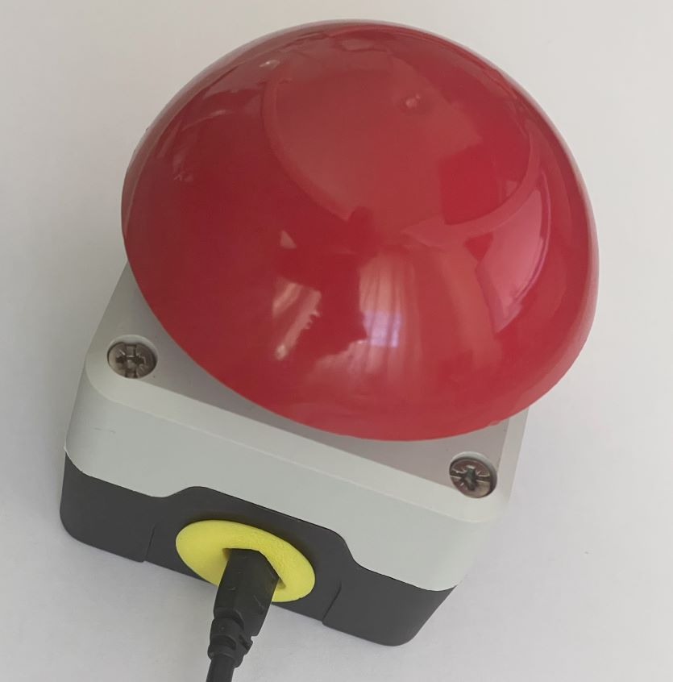

# Buzzer

Use a buzzer to trigger photos in the photobooth

## Big Red Hot Button

{ width="300" }

This button is based on ESP powered by battery.
It emulates a keyboard and thus can be used with the photobooth-app or other photobooth projects that use keyboard input to trigger captures.

The power consumption measured is about 60mA - the battery has 1100mAh capacity. This gives a runtime if fully charged of 18h.
Loading works only if battery is connected, means the button must be switched on to load.

### Hardware and Assembly

see separate git repository <https://github.com/mgrl/photobooth-buzzer>

### ESP Microcontroller Software

see separate git repository <https://github.com/mgrl/photobooth-buzzer>

### Setup in photobooth app

Go to admin dashboard -> configure -> tab: hardwareinputoutput.

- Enable keyboard input
- choose the character (default = c) to take a picture.
