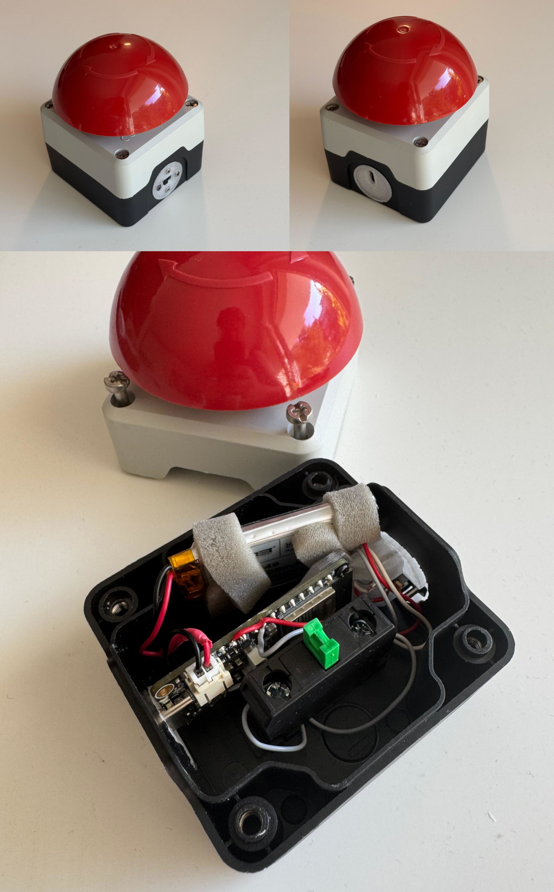

# Phtobooth-App Buzzer

Use this bluetooth buzzer to trigger actions in the photobooth-app.

This gadget is based on an ESP board powered by battery.
It emulates a bluetooth keyboard and thus can be used with the photobooth-app or other photobooth projects that use keyboard input to trigger actions.

{ width="300" }

### Hardware and Assembly

See separate git repository <https://github.com/photobooth-app/photobooth-buzzer>.

### ESP Microcontroller Software

See separate git repository <https://github.com/photobooth-app/photobooth-buzzer>.

### Setup in photobooth app

Go to admin dashboard -> configure -> tab: hardwareinputoutput.

- Enable keyboard input
- choose the character (default = i) to take a picture.
