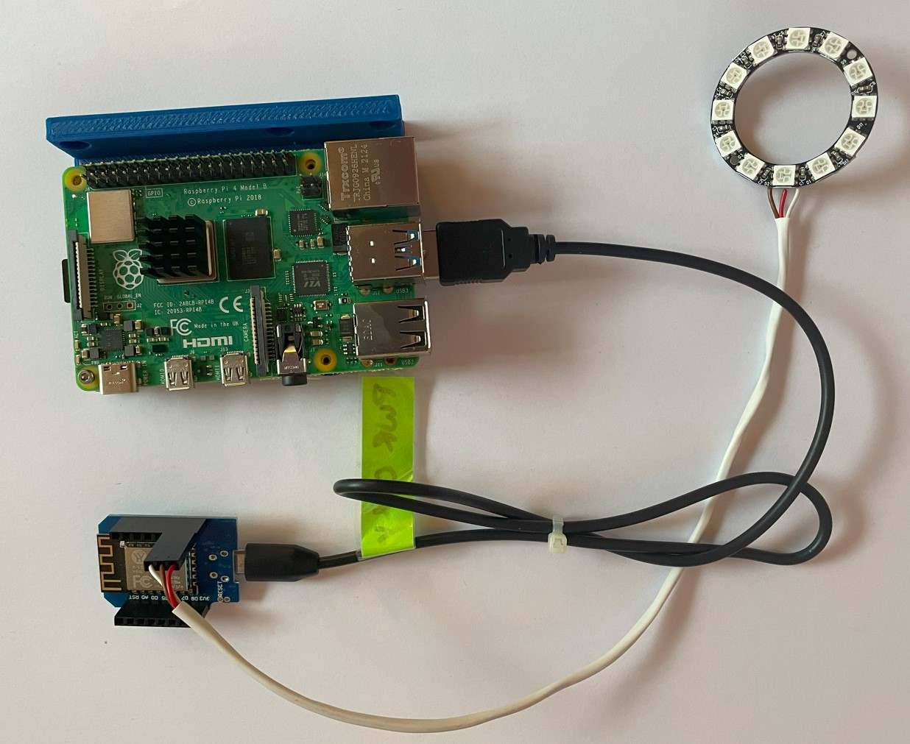

# WLED Module

The photobooth-app integrates perfectly with [WLED](https://kno.wled.ge/).
Use the integration to add a nice LED countdown animation, still and video capture indication lights while the users interact with the booth.
WLED is installed on inexpensive ESP8266/ESP32 modules to control NeoPixels like WS2812B, WS2811, SK6812 LEDs.

See an example using a small circle-formed LED strip:

<video controls>
<source src="../../assets/wled/takepicture.mp4" type="video/mp4">
</video>

## Hardware

### BOM

- ESP board
    - ESP32 boards are preferred nowadays: ESP32-C3 Zero/SuperMini is a decent option
    - ESP8266 still work with WLED: Wemos D1 mini
- LEDs:
    - Ring light for the legacy 3d printed photobooth or
    - 4x4 Matrix light for the latest 3d printed photobooth coming with the wigglecam addon.
- some cables

### Wiring

The ring light needs 5V, GND and a signal line to control the colors.

!!! info "Use IO lines not connected internally"

    On the [D1 mini board](https://www.wemos.cc/en/latest/d1/d1_mini_lite.html#pin), the GPIO2 labelled D4 is closest to 5V/GND so it would be convenient to use. But it is connected to a builtin led. Since the LED is not needed, and might shine through the 3d printed case, it is recommended to use a different IO.

<figure markdown>
  
  <figcaption>Wiring overview: ESP connected via USB to power the device and communicate with the app. The ringlight is mounted around the camera lens in the 3d printed box.</figcaption>
</figure>

## Setup WLED

!!! info "WLED documentation"

    Head over to the [WLED project documentation](https://kno.wled.ge/basics/getting-started/) for more detailed installation instructions and hardware setup.

In short, follow these steps

- Connect the ESP board via USB to the computer running the photobooth-app.
- Install WLED using the [webinstaller](https://install.wled.me/)
- Connect the WLED device to your WiFi. The webinstaller asks for the credentials and configures the ESP accordingly.
- Visit the WLED website on the ESP and configure.
- If you use exact the same items listed in the BOM, you can start using following
    - Ringlight variant (all photobooth-app versions compatible)
        - [wled_cfg](../assets/wled/wled-ringlight/wled_cfg.json) Using GPIO4 labelled D2
        - [wled_presets](../assets/wled/wled-ringlight/wled_presets.json)
    - 4x4 Matrix variant (new since version 9 and the updated 3d print reference photobooth)
        - [wled_cfg](../assets/wled/wled-4x4matrix/wled_cfg.json) Using GPIO4
        - [wled_presets](../assets/wled/wled-4x4matrix/wled_presets.json)
        - [ledmap](../assets/wled/wled-4x4matrix/ledmap.json) Check the WLED documentation how to upload the ledmap on the device.

- In the photobooth-app [enable the WLED plugin](../reference/plugins.md) and select the serial port of the ESP in the admin config.

For more detailed instructions on the WLED device itself see the [WLED](https://kno.wled.ge/basics/getting-started/) website.

## Define your own presets

When the photobooth-app starts a countdown, takes a picture or captures a video, it will send commands via serial interface to the WLED module. The presets are identified by the IDs as follows:

- ID 1: standby (usually LEDs off)
- ID 2: countdown (animates countdown)
- ID 3: shoot (imitate a flash)
- ID 4: recording (imitate a red light to visualize ongoing record)
- ID 10: Initial preset after WLED gets powered. Used to display an animation until the app has booted and activates the standby preset.
- ID 20: Countdown when stills are captured (new in v9)
- ID 21: Countdown when videos are captured (new in v9)
- ID 22: Countdown when multicamera pictures are captured (new in v9)

Define the presets on your own in the WLED webfrontend or use the presets/config from above. Once added, in the photobooth-app enable the WLED integration and file the serial port of the WLED module in the photobooth-app's config. Check the logs on startup whether the module is detected correctly.
