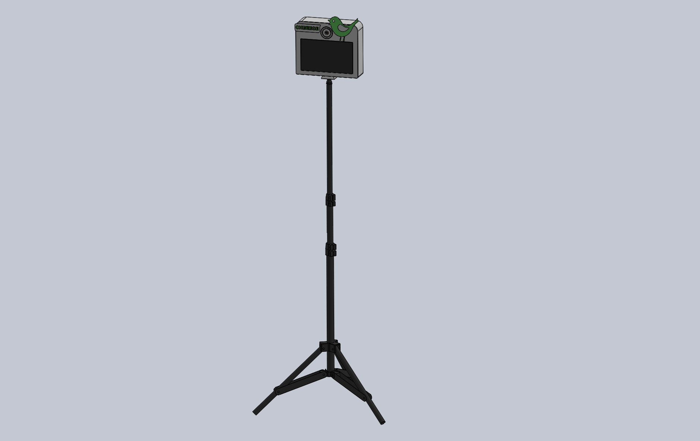
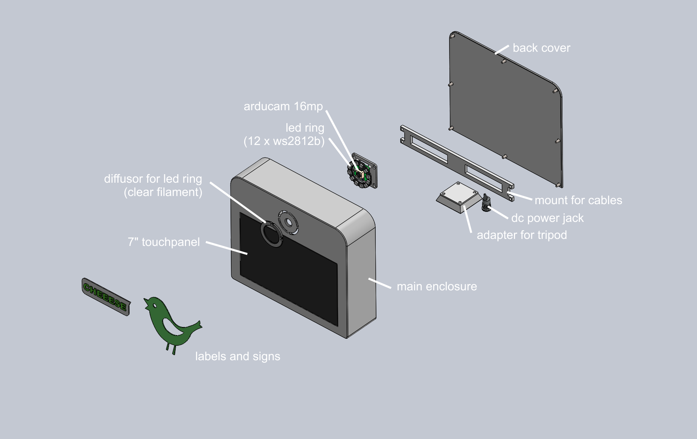
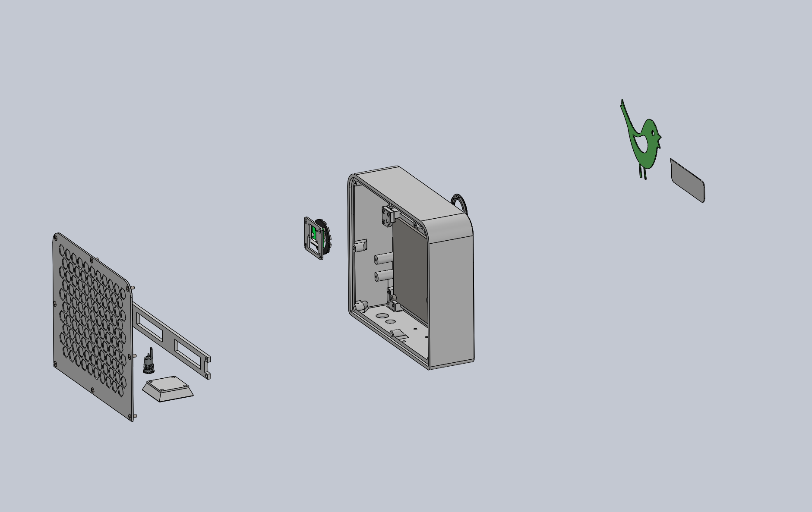
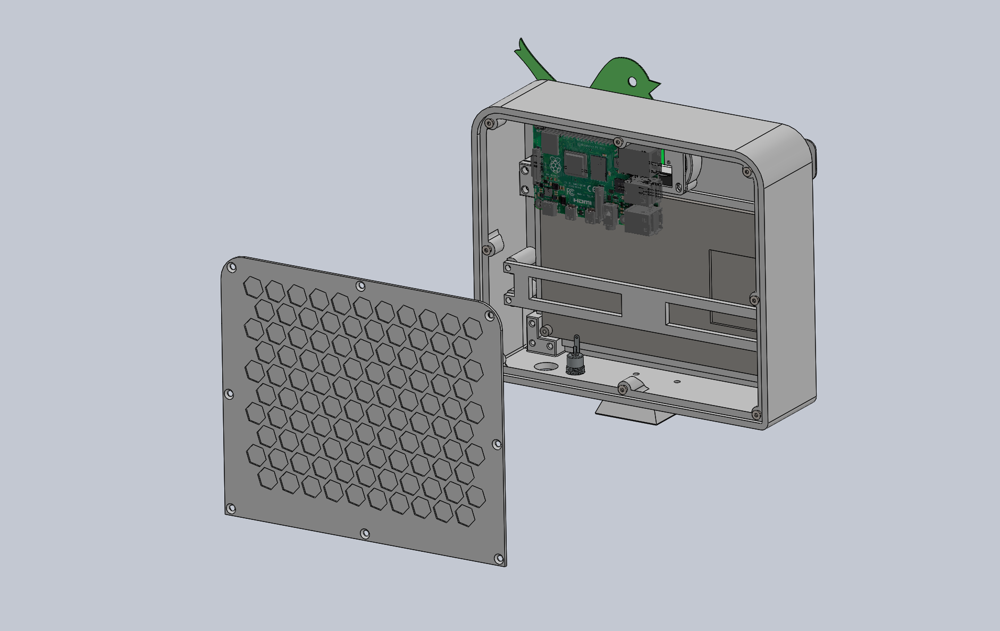
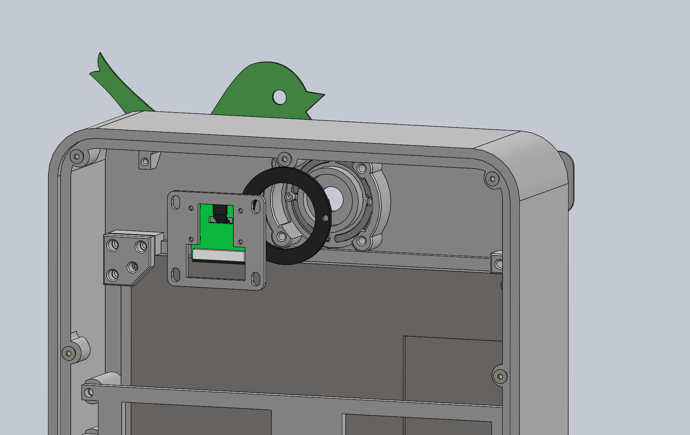
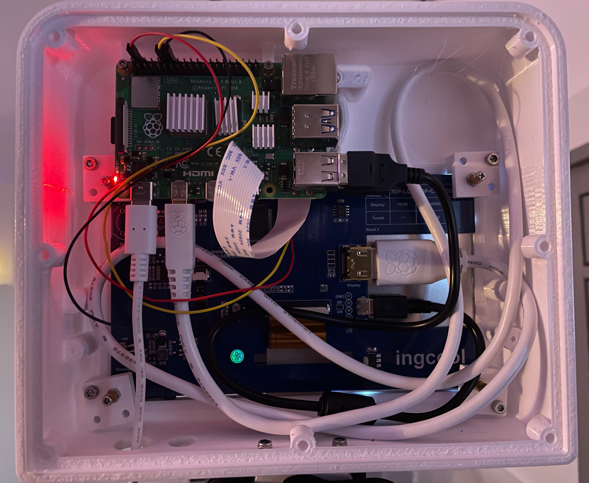

# 3D printed Photobooth

In general the photobox can be custom made out of materials you prefer.
To develop and as starting point a reference design to 3d print is provided.

If you want to add your box to this page, send a message in the [discussions, category show and tell 📣](https://github.com/mgrl/photobooth-app/discussions/categories/show-and-tell).

## 3D printed reference

The photobooth is made out of a 3d printed case.
Find the CAD files in the github repo: <https://github.com/mgrl/photobooth-3d>

### Features

- solidworks files available
- compact design
- camera module integrated
- led ring signaling photo countdown and when the photo is actually taken
- 7" touchscreen
- remote buzzer

### Renderings and Photos

<figure markdown>
  { width="400" }
  <figcaption>Total including stand tripod</figcaption>
</figure>

<figure markdown>
  { width="400" }
  <figcaption>Total view including stand tripod</figcaption>
</figure>

<figure markdown>
  { width="400" }
  <figcaption>Parts named</figcaption>
</figure>

<figure markdown>
  { width="400" }
  <figcaption>Rear view</figcaption>
</figure>

<figure markdown>
  { width="400" }
  <figcaption>Rear view 2</figcaption>
</figure>

<figure markdown>
  { width="400" }
  <figcaption>Rear view 3</figcaption>
</figure>

<figure markdown>
  { width="400" }
  <figcaption>Rear photo</figcaption>
</figure>
