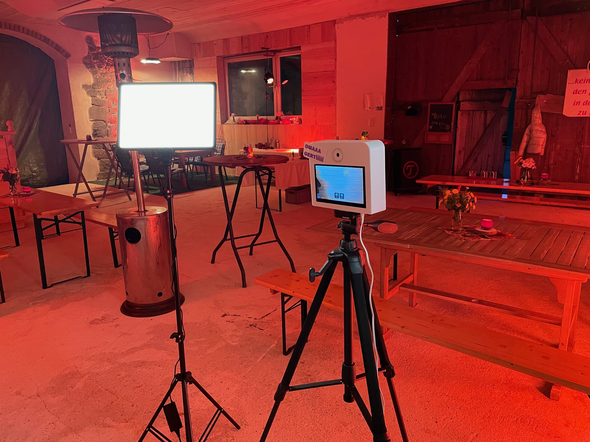
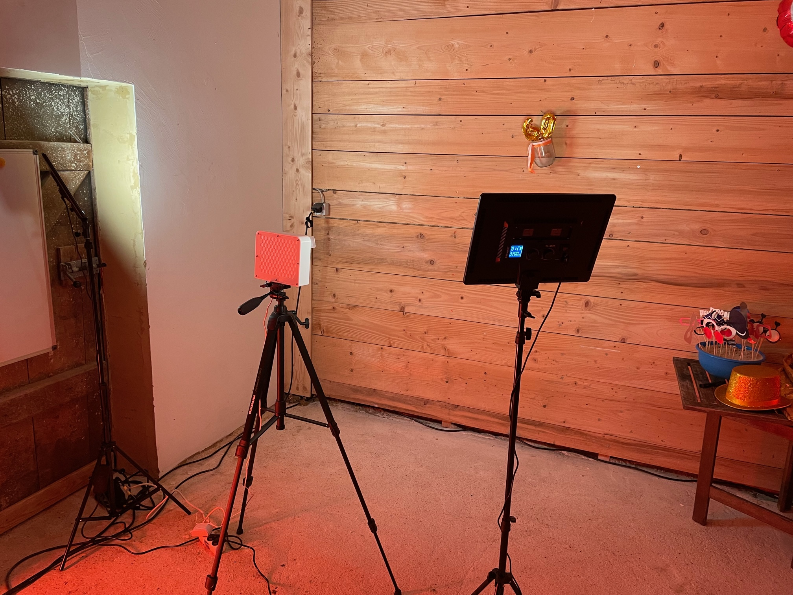
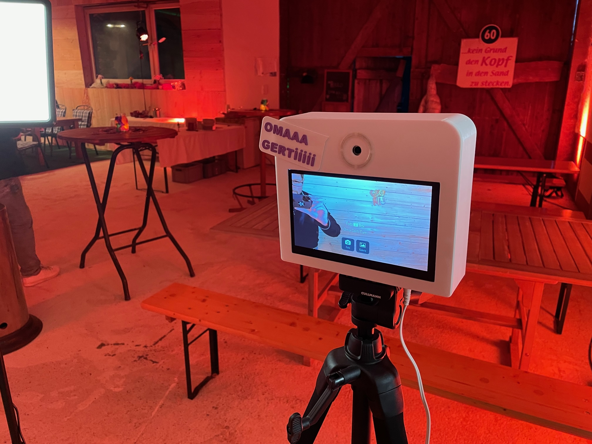

# Projects and Examples

This is a collection of user made photobooth projects. Inspire and start making yours! 🛫

If you want to add your booth to this page, send a message in the [discussions, category show and tell 📣](https://github.com/photobooth-app/photobooth-app/discussions/categories/show-and-tell).

## Example projects

### 3D Printed Photobooth Reference

Compact 3d printed photobooth. Raspberry Pi 4B and Picamera2 system. Camera is the camera module 3.
Lighting with permanent light sources.

Additional information:

- [3d printed box](./photobox3dprint.md)
- [buzzer](https://github.com/photobooth-app/photobooth-buzzer)
- [image share one via QR code](./setup/configuration/qrshareservice.md)

{ width="300" }
{ width="300" }
{ width="300" }

### Modular photobox build

- Created by [dtimes](https://github.com/dtimes)
- modular design, box should operate with a webcam if no better image quality is needed (aka "basic setup")
- if needed "DSLR module" can be attached to the top of the "basic setup" box, this second box houses the mounted DSLR
- [Questions? Have a look in the show and tell section in GitHub discussions](https://github.com/photobooth-app/photobooth-app/discussions/454)

It's meant for personal / non commercial use but should survice being used by friends and family.

### Projet de Boîtier pour Photobooth en Impression 3D made in Switzerland

Projet de Boîtier pour Photobooth en Impression 3D - Raspberry Pi 4 ou 5
3D-Printed Photobooth Enclosure Project - Raspberry Pi 4 or 5

Additional information:

- [3d print files](https://makerworld.com/de/models/774344#profileId-710644)
- Created by [cedric-Swiss](https://github.com/cedric-Swiss)
- [Questions? Have a look in the show and tell section in GitHub discussions](https://github.com/photobooth-app/photobooth-app/discussions/369)

{ width="300" }
{ width="300" }
{ width="300" }

### Other photobooth-app projects

- [Peda1996](https://github.com/photobooth-app/photobooth-app/discussions/145)
- [Striker62](https://github.com/photobooth-app/photobooth-app/discussions/244)

## Yours here? That would be awesome! 🕶️

If you want to add your booth to this page, send a message in the [discussions, category show and tell 📣](https://github.com/photobooth-app/photobooth-app/discussions/categories/show-and-tell).
