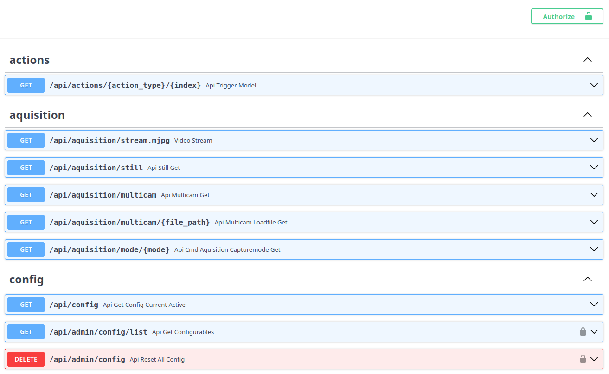

# REST API

The photobooth-app comes with a Vue3 frontend.
The frontend relies on the REST-API provided by Python/FastAPI. This way, the frontend interacts with the underlying hardware, all through the REST-API to stream a live video, trigger captures and share media files.

If you want to add your own solutions to trigger a capture externally or request status information from the photobooth-app, there is an Swagger-UI available. All exposed endpoints are documented in the Swagger-UI and you can easily tinker around in the interactive documentation.

The Swagger-UI is available on the same device as the app: [http://localhost:8000/api/doc](http://localhost:8000/api/doc). To open it from another device, replace `localhost` by the hostname/IP of the device running the app.

{ width="600" }
