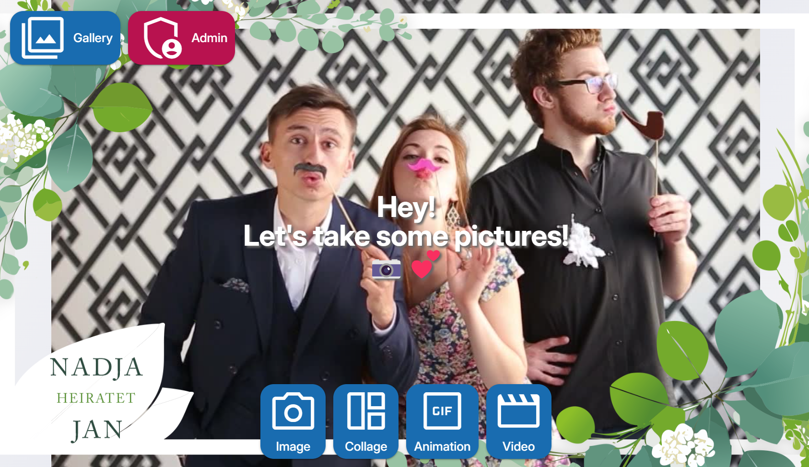

# Customize the Theme

To customize the visual apperiance of the photobooth app, add your rules to the `./userdata/private.css` file.

## Example: Adjust the Buttons' Size on the Frontpage

Depending on your screen you might want to reduce the size of the buttons on the frontpage. First rule changes the text, second the icon size.

```css title="private.css"
.action-button {
    font-size: 1.0rem;
}
.action-button *>.q-icon {
    font-size: 4.5rem;
}
```

## Adjust the font-size of the countdown

```css title="private.css"
#countdown-circular-progress {
 font-size: 50vh !important;
 font-weight: normal !important;
}
```

## Example: Colorize the Buttons on the Frontpage

!!!note
    This feature is natively included starting from v5. Below is only for reference and will be removed later.

Individual colors can be applied, first button is -0. `.action-button` selects all buttons.

```css title="private.css"
.action-buttons {
    .action-button {
            background-color: grey !important;
    }
    
    .action-button-0 {
            background-color: red !important;
    }
    .action-button-1 {
            background-color: blue !important;
    }
    .action-button-2 {
            background-color: green !important;
    }
}

```

## Adjust the Livestream

You may want to change the preview video element to cover the full screen and zoom in a bit. Zooming in is useful in a two camera setup to adjust the image window of the livepreview (needs to capture a larger scene) to the camera capturing the still images.

While the livestream looks nicer if it covers the full screen, some parts of the livestream can be cropped.
Thus the resulting photo shows a different aspect ratio and might not match the endusers intention.
So the default is to `contain` the background. If you want to change to `cover`, add the following rule to `private.css`.

```css title="private.css"
#overlay-image {
  width: 100vw;
  height: 100vh;
  background-size: cover; /* default: contain to avoid cropping */
  transform: scale(1.5); /* default: 1.0 to apply no zoom. 1.5 zooms in, smaller values than 1.0 usually make no sense */
}

```

## Add a frame to the frontpage

!!!note
    This feature is natively included starting from v5. Below is only for reference and will be removed later.

If you want to add a custom frame with transparency above the livestream, apply the following CSS and place the frame in the userdata. In this example, the frame is place in `./userdata/frames/filename.png`.



```css
#preview-stream::after {
    content: "";
    position: absolute;
    top: 0;
    left: 0;
    right: 0;
    bottom: 0;
    background-image: url('/userdata/frames/filename.png'); /* point to your filename */
    background-size: cover; /* cover all area instead just contain */
    background-position: center;
    background-repeat: no-repeat;
    pointer-events: none; /* frame is no target, allow interaction with other elements */
    z-index: 1; /* ensure frame is above stream */
    opacity: 1.0; /* optional transparency for frame */
    transform: scaleX(-1); /* flip horizontal if mirror effect is enabled this is needed */
}
```

## Contribute, add your examples here

Reach out in a [discussion](https://github.com/photobooth-app/photobooth-app/discussions) to add your rules here so others can benefit from your work 🙏.
