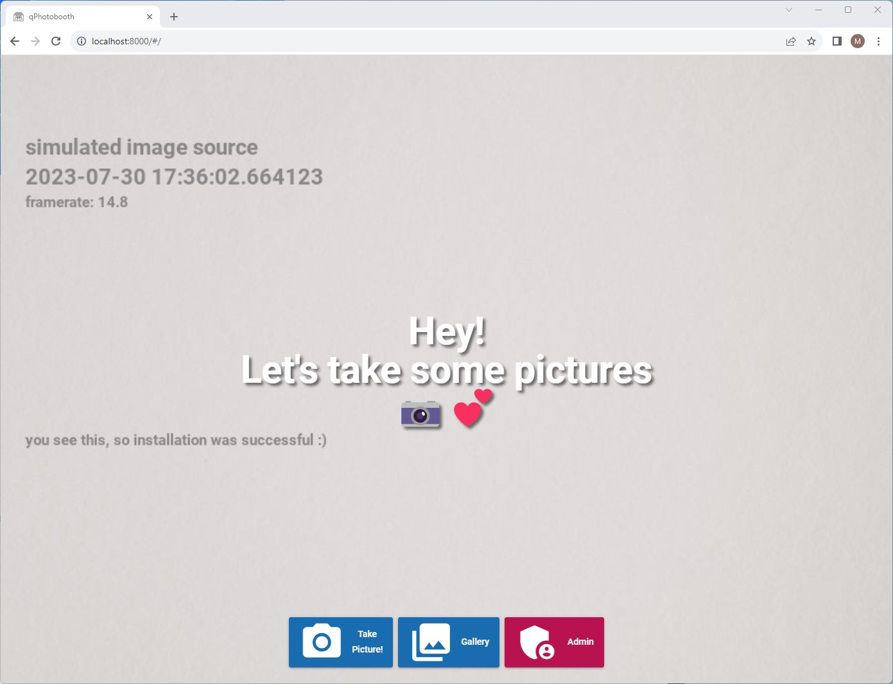
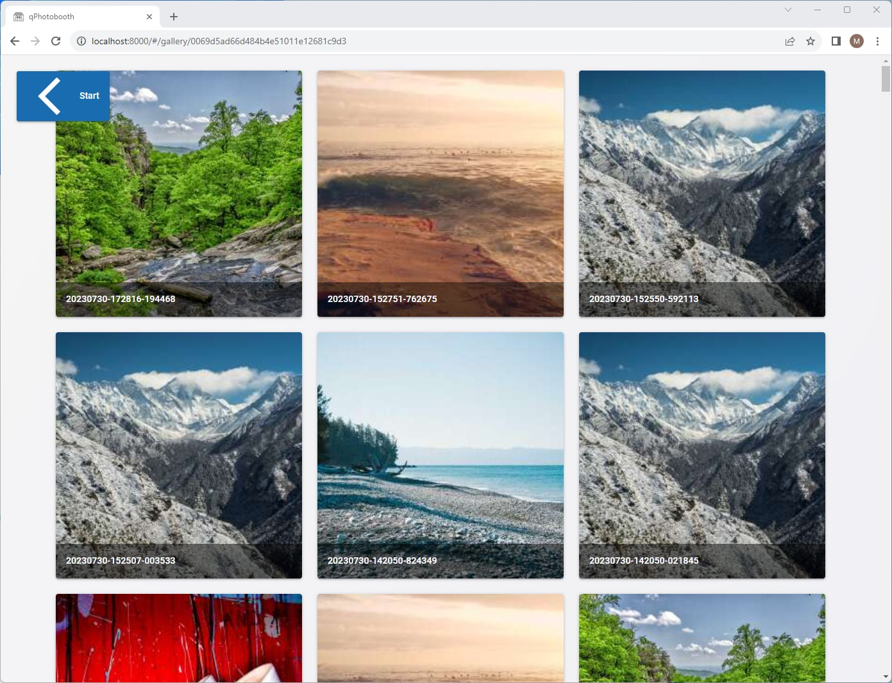
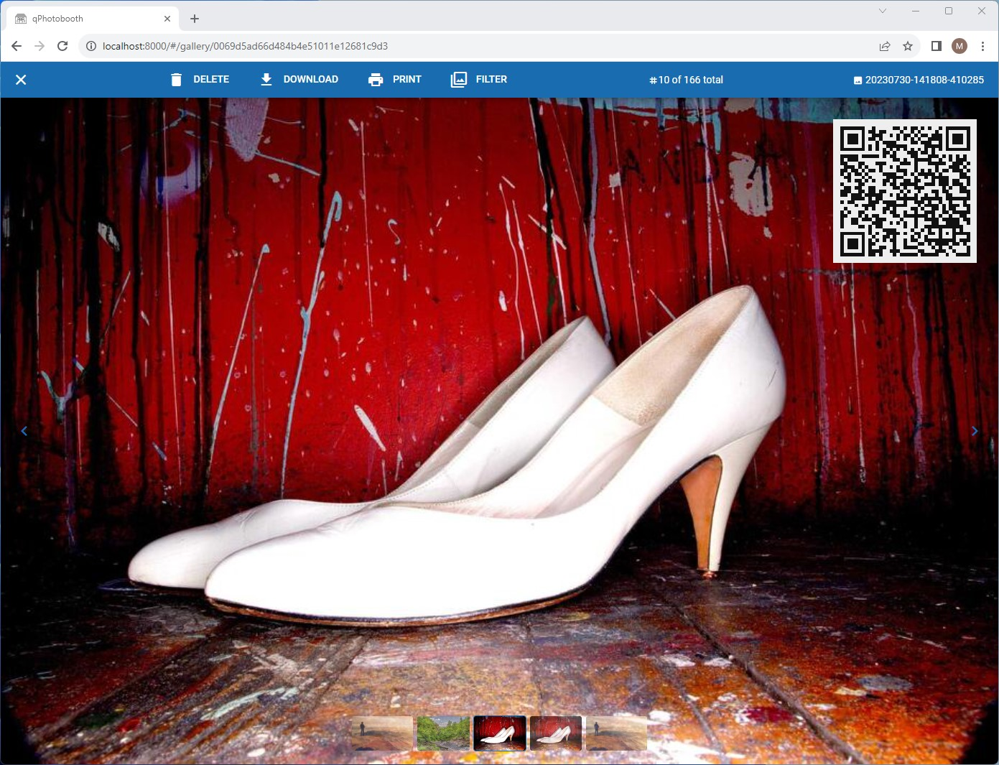
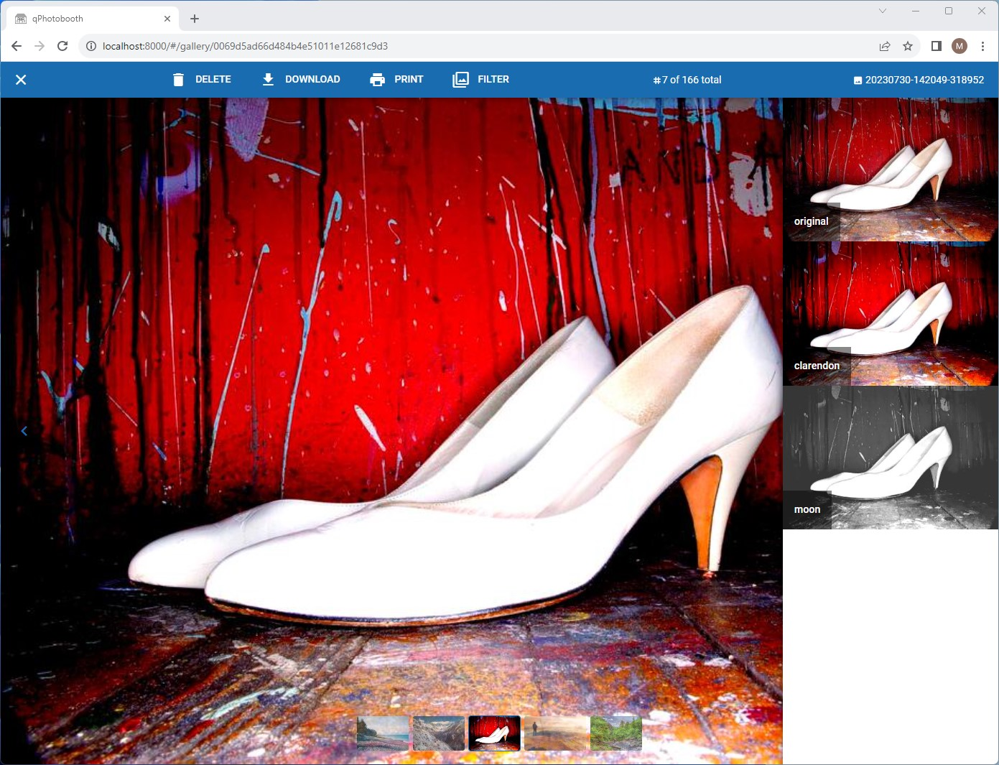
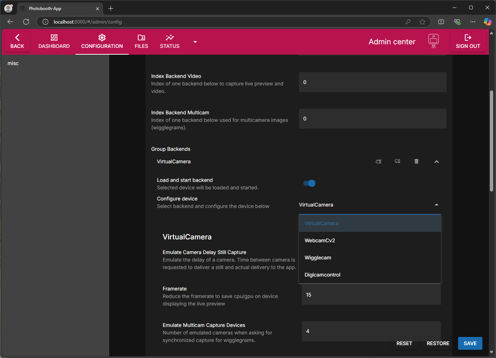
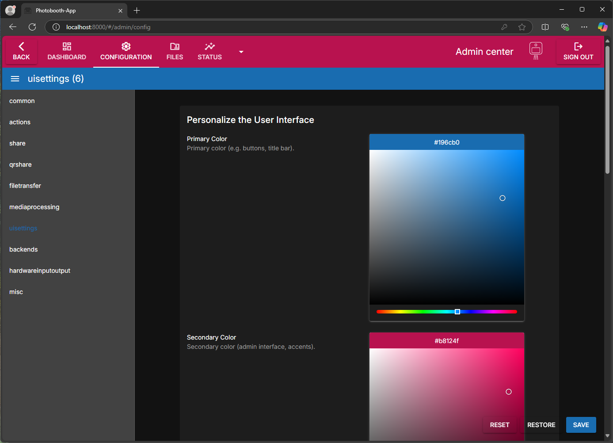
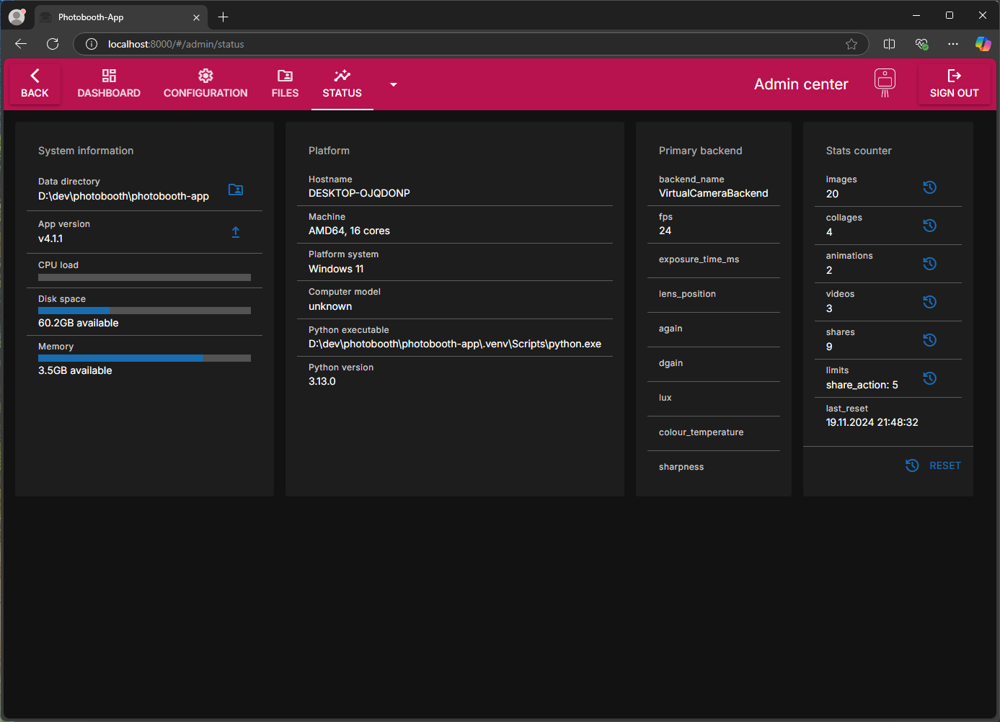

# Screenshots

<figure markdown>
  { width="400" }
  <figcaption>Frontpage</figcaption>
</figure>

<figure markdown>
  { width="400" }
  <figcaption>List images in the gallery</figcaption>
</figure>

<figure markdown>
  { width="400" }
  <figcaption>View image in the gallery</figcaption>
</figure>

<figure markdown>
  { width="400" }
  <figcaption>Users can change the filter</figcaption>
</figure>

<figure markdown>
  { width="400" }
  <figcaption>Choose camera backend in admin panel</figcaption>
</figure>

<figure markdown>
  { width="400" }
  <figcaption>Personalize the user interface in admin panel</figcaption>
</figure>

<figure markdown>
  { width="400" }
  <figcaption>View latest logs and status information in the admin panel</figcaption>
</figure>
