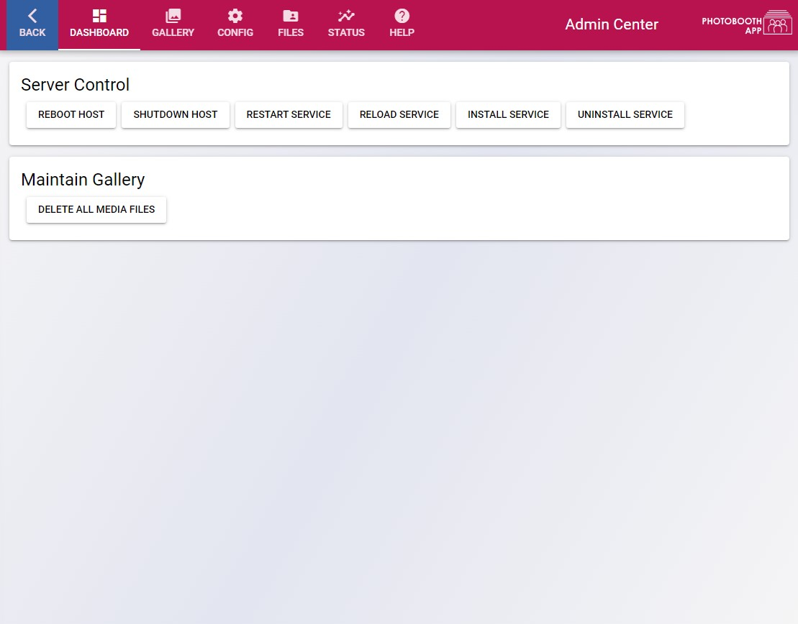
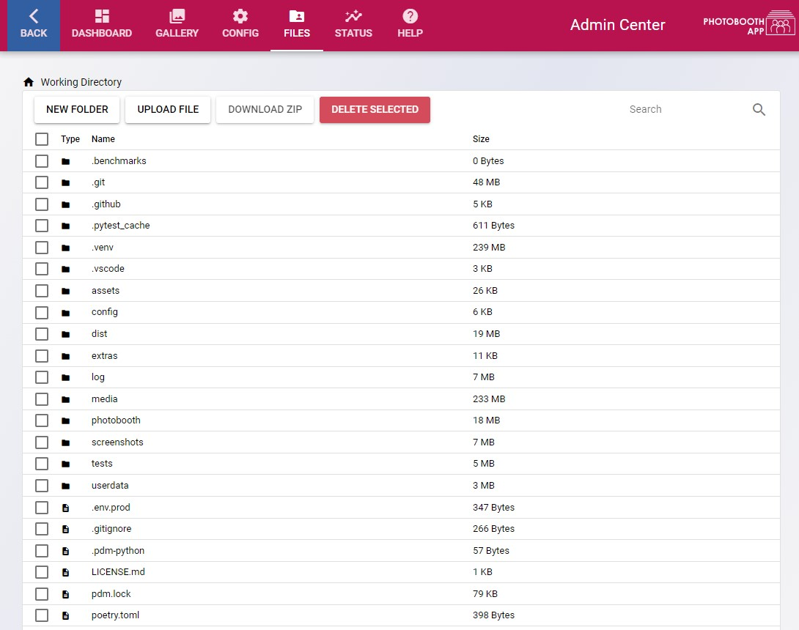
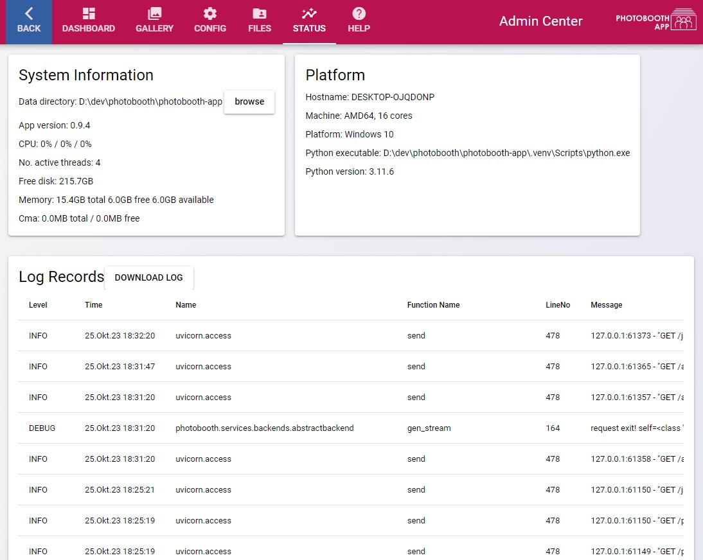
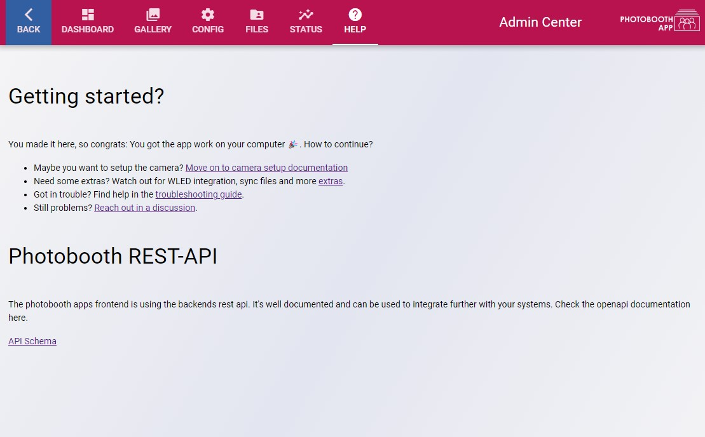

# Admin Center

!!! info
    The default password to login the admin center is `0000`.

The admin center is the central place to configure the photobooth software. You can also use it to upload and download files to the device.

On the photobooth device browse to the admin center to configure your photobooth app:
[http://localhost:8000/#/admin](http://localhost/#/admin)

!!! info
    From other devices you might need to replace ``localhost`` by the hostname of the booth.
    Port ``8000`` is default if you did not change it.

## Overview

<figure markdown>
  { width="500" }
  <figcaption>Enter the admin pages, dashboard is the start</figcaption>
</figure>

### Server Control

- Shutdown or rebooth the host computer.
- Restart the service: On linux if the photobooth is installed as ``systemctl``-service a restart can be triggered.
- Reload service is to gracefully reload all resources and backends.
- Install service: On linux automatically install the systemctl service
- Uninstall service: If service shall not start on boot, uninstall the service. The webfrontend is not accessible until manually started again or the service is installed like described in the installation.

### Maintain gallery

- Delete all media files. Take care to backup your data first!

## Config

The configuration is divided in logical sections. After changing the config use the buttons to

- Persist: Send configuration to server, persist it on disk. Some changes will take effect only after restarting the service.
- Restore: Load current config from disk and display.
- Reset: Revert to default settings and delete config files from disk.

See [reference for more details](../reference/configuration.md).

## Files

Manage your files in one place - the filebrowser. Useful to download captured images or upload custom files that can be used in pipeline stages like frames or background images.

The filebrowser allows to

- create new folders
- upload files
- download zip files containing selected files and folders and
- delete selected files and folders.

<figure markdown>
  { width="500" }
  <figcaption>Manage files in the filebrowser.</figcaption>
</figure>

## Status

Some statistics, platform and system information. Also all logfiles are displayed.

<figure markdown>
  { width="500" }
  <figcaption>See important information and logs in the status dashboard</figcaption>
</figure>

## Help

Collection of information that might be helpful.
Also the REST-API documentation is linked. It's interactive, so you can test the REST-API right in your browser.

<figure markdown>
  { width="500" }
  <figcaption>Some links on help page you might find useful.</figcaption>
</figure>
