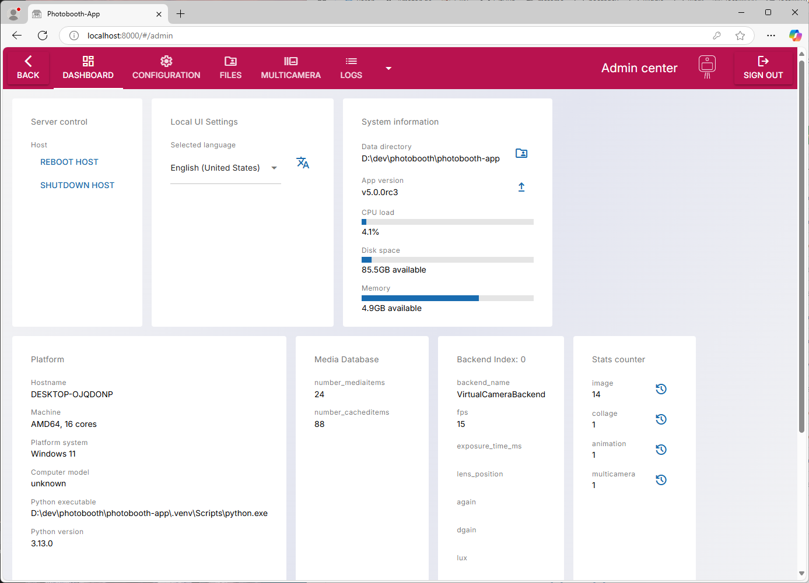
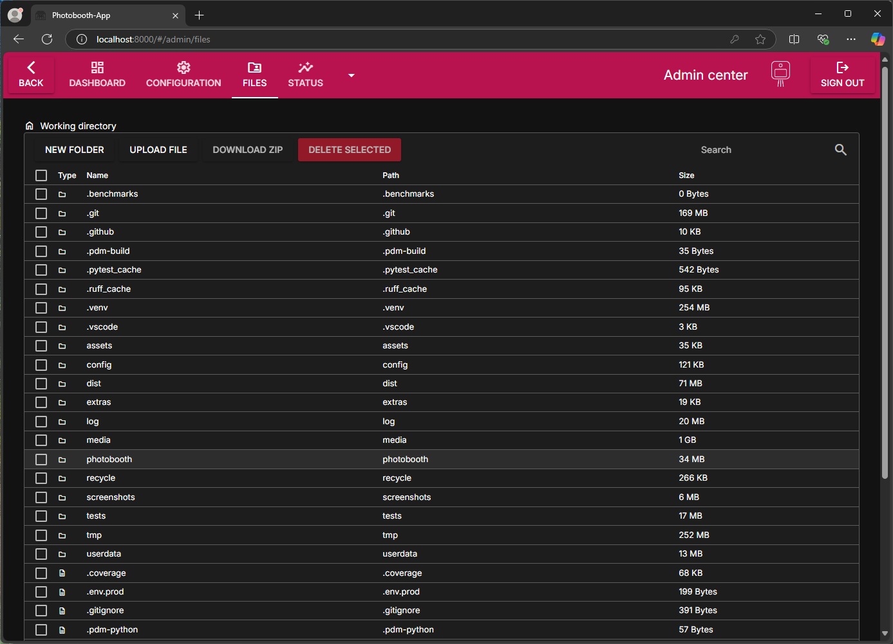

# Admin Center

The admin center is the central place to configure the photobooth software. You can also use it to upload and download files to the device.

!!! info

    The default password to login the admin center is `0000`.

On the photobooth device browse to the admin center to configure your photobooth app:
<http://localhost:8000/#/admin>.

!!! info

    From other devices you need to replace ``localhost`` by the hostname of the booth.
    Port ``8000`` is default if you did not change it.

## Dashboard

<figure markdown>
  { width="500" }
  <figcaption>Enter the admin pages, dashboard is the start</figcaption>
</figure>

### Server Control

- Shutdown or reboot the host computer.
- Service Controls (only on linux platform):
    - Restart the service: On linux if the photobooth is installed as `systemctl`-service a restart can be triggered.
    - Reload service is to gracefully reload all resources and backends.
    - Install service: On linux automatically install the systemctl service
    - Uninstall service: If service shall not start on boot, uninstall the service. The webfrontend is not accessible until manually started again or the service is installed like described in the installation.

### Local UI Settings

The app supports several languages, many of these are translated automatically using AI.
If the translation is off and you want to improve it, [you are very much invited 🤝](https://github.com/photobooth-app/photobooth-app/blob/main/CONTRIBUTING.md#help-to-translate-the-app)

### Media Database

- Delete all media files. Take care to backup your data first!

### Usage and Limit counter

The app counts how many images, collages and so on were taken. You can reset the counter manually.
The limit counter would limit the amount of shares/prints that are allowed for an event.

### Other Information panels

The other panels are information about the backends. Also some diagnostic data about the system is displayed.

## Configuration

The configuration is divided in logical sections. After changing the config use the buttons to

- `SAVE`: Send configuration to server and persist it on the disk. **Most changes will take effect only after restarting the app!**
- `RELOAD`: Reload the current config from disk to revert changes made.
- `RESET`: Revert to default settings and delete config file from the disk.

All configuration elements have a description that should be helpful. More details on the sections [actions and trigger](./actions.md), [camera setup](./camera_setup.md) and more you find here in the chapter next to this page.

## Files

Manage your files in one place - the filebrowser. Useful to download captured images or upload custom files that can be used in pipeline stages like frames or background images.

The filebrowser allows to

- create new folders
- upload files
- download zip files containing selected files and folders and
- delete selected files and folders.

<figure markdown>
  { width="500" }
  <figcaption>Manage files in the filebrowser.</figcaption>
</figure>

## Help

Collection of information that might be helpful.
Also the REST-API documentation is linked. It's interactive, so you can test the REST-API right in your browser.

<figure markdown>
  { width="500" }
  <figcaption>Some links on help page you might find useful.</figcaption>
</figure>
