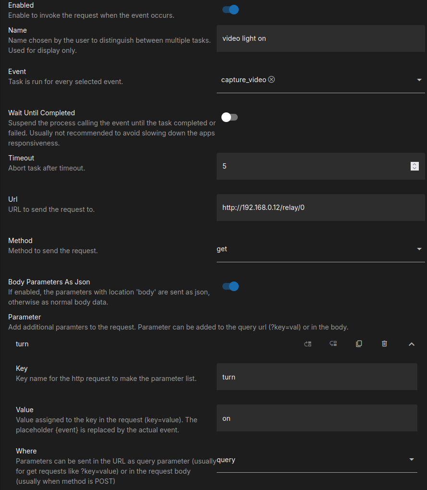

# Commander

The commander plugin allows to hook

- HTTP calls and
- local commands

to be bound to events. 

## Available Events

| Event            | Triggers                                                                                                                                           |
|------------------|----------------------------------------------------------------------------------------------------------------------------------------------------|
| init             | Once during app initialization.                                                                                                                    |
| start            | When the services are started/restarted. If config changes apply, this is triggered, while init is not retriggered.                                |
| stop             | When the services are stopped/restarted. If config changes apply, this is triggered.                                                               |
| counting         | Countdown for a capture started.                                                                                                                   |
| capture          | Just before any capture.                                                                                                                           |
| capture_still    | Just before still captures.                                                                                                                        |
| capture_multicam | Just before multicam captures.                                                                                                                     |
| capture_video    | Just before video captures.                                                                                                                        |
| captured         | Just after any capture taken.                                                                                                                      |
| finished         | When the overall job is finished. For example when multiple stills are collected for a collage, finished will trigger once all captures are taken. |

## Configuration

The configuration is highly specific to your individual setup. Following is an example for a Shelly device accessible via HTTP.

<figure markdown>
  { width="400" }
  <figcaption>Example using an external HTTP device to turn on a relay when a video is captured</figcaption>
</figure>

<figure markdown>
  { width="400" }
  <figcaption>Example using an external HTTP device to turn on a relay when a video is captured</figcaption>
</figure>
