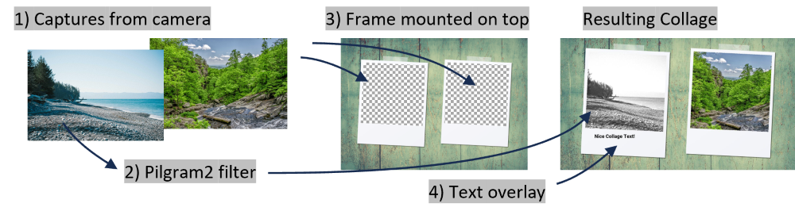

# Post-Processing Captures

The mediaitems (images, collages, animated gifs, videos and 3d wigglegrams) are postprocessed using a configurable pipeline consisting of several stages.
The pipeline starts with the original mediaitem and creates a unprocessed full version as basis for the pipeline to apply to. The different media types can have differently configured pipelines that process the image one by one. The processed mediaitem is stored to the gallery finally.

## Pipelines

There are different postprocess pipelines available. They can be configured in the admin center.
The pipeline consists of several stages, each can be enabled and configured separately, see next chapter.

When a pixel coordinate needs to be given, the coordinate origin is top/left, so (0/0) refers to the top-left edge of an image.

### Single Images-Pipeline

The single image pipeline runs following stages in given sequence:

1. remove chromakey (greenscreen removal), replace by transparency
2. apply pilgram2 filter (instagram like filters)
3. fill background with a solid color
4. add background image (useful only if no solid color was added)
5. add a frame with transparent areas. Captured images shine through transparent area. Use PNGs with transparency!
6. text overlay

### Collage-Pipeline

The collage pipeline runs following stages in given sequence:

1. run single images stages (chromakey, pilgram2, background only)
2. merge captured images and predefined images on one canvas
3. fill background with a solid color
4. add background image (useful only if no solid color was added)
5. place image on top. Captured images shine through transparent area. Use PNGs with transparency!
6. text overlay

### Animated GIF-Pipeline

The gifs are made out of single captures, not a video.
The animated gif pipeline runs following stages in given sequence:

1. run single images stages (currently only texts)
2. line up captured images as defined in one GIF

### Video-Pipeline

The videos are created from cameras livestream if available.
There are basic options currently to set:

1. The maximum duration of a video. The caputure process is stoppable by the user before the maximum duration is reached.
2. Boomerang option enable to append the video in reverse.
3. Choose a framerate of the video.

### Multicamera 3D Wigglegram-Pipeline

No description, yet. You're invited to contribute. 👋

### Print-Pipeline

Feature not yet implemented. You're invited to contribute. 👋

## Stages

### Chromakeying

Greenscreen chromakeying was actually removed in v8 and replaced by a more generic AI background removal tool.
It is to remove background parts from captured images (no video support) and makes removed parts transparent so they can be filled with colors or images in subsequent stages.

### Instagram-Like Color-Filter

Apply a default color filter. Choose from [pilgram2's available filters](https://github.com/mgineer85/pilgram2).
There is also the option for the user to change the filter in the gallery. See UI configuration in admin dashboard.

### Background Fill Solid Color

When using the chromakeying / background removal stages, the removed background is left empty and transparent. With this stage, the transparent area is filled with a solid color.

### Background Image

When using the chromakeying / background removal stages, the removed background is left empty and transparent. With this stage, the transparent area is filled with an image.

### Frame Image

Single images captured can be overlaid by a frame. For this stage you need a PNG with transparent area. The captured image will be inserted in the transparent area. The width and height of the transparent area is automatically calculated and the algorithm tries to fit most of the captured area. If aspect ratio of captured image and transparent area are very different, some parts of the captured image can be cropped.

### Texts

Texts that are overlaid the finished image. Use it to easily individualize the images without having to create a new background images where a picture would get inserted to. Custom fonts are supported.
