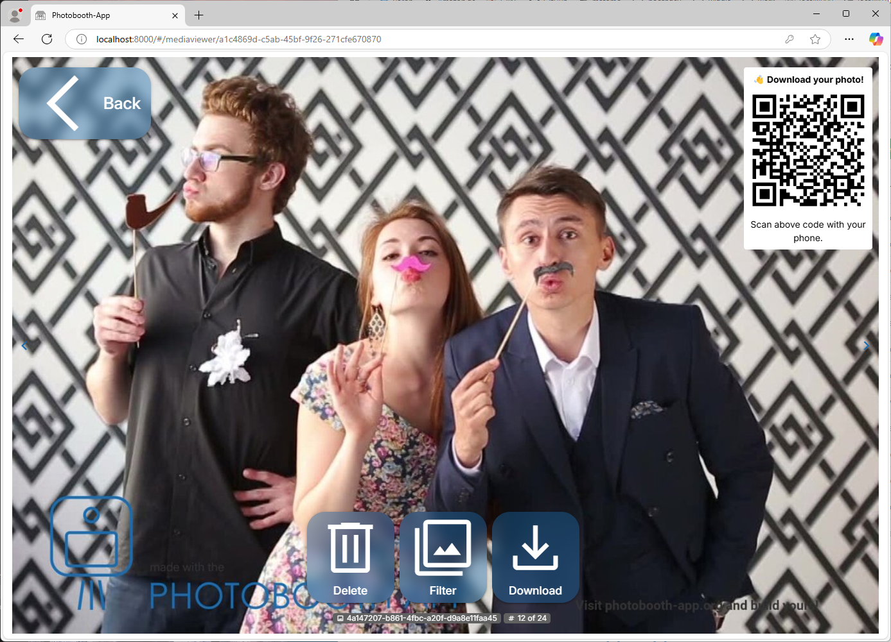

# Synchronize and Share via QR Code

After setup, the users of the photobooth-app can download their images, gifs and videos simply by scanning a QR code.
The QR code points to the file directly or a portal that allows to reshare the media.
Using the portal, the user can share the media file using the apps on his or her smartphone.

<figure markdown>
  { width="500" }
  <figcaption>Users scan the QR code to download the displayed image on their mobile.</figcaption>
</figure>

## Options to share via QR code

| Option                         | Synchronizer Plugin                                                                                                 | Your Custom Implementation                                                                                   |
| ------------------------------ | ------------------------------------------------------------------------------------------------------------------- | ------------------------------------------------------------------------------------------------------------ |
| Description                    | Sync via FTP and share via HTTP(S)                                                                                  | Share via local WiFi-Hotspot                                                                                 |
| Prerequisites                  | FTP supporting MLSD command (recommended) or NextCloud server                                                                               | WiFi Hotspot                                                                                                 |
| Online / Offline               | Online, Internet required                                                                                           | Offline, no Internet required                                                                                |
| Enduser Usage Complexity Level | Easy                                                                                                                | Complex                                                                                                      |
| Setup Complexity Level         | Easy (FTP), Medium (NextCloud)                                                                                      | Advanced                                                                                                     |
| Pros                           | ➕ Automatic immediate and time-interval synchronization<br>➕ Easy setup<br>➕ Convenient for user<br>➕ Could be used as immediate backup     | ➕ No need to synchronize<br>➕ No issues if internet service is bad<br>➕ Less likely to conflict with GDPR |
| Cons                           | ➖ Internet service might fail any time<br>➖ Images shared via (private) internet service might conflict with GDPR | ➖ Inconvenient for user: Smartphones need to log in local WiFi<br>➖ Custom setup                           |

## Setup the Synchronizer Plugin

- In the Admin Center go to Configuration -> Synchronizer.
- Configure a FTP or NextCloud-Backend to sync to.
- Save the configuration.
- Take a picture and check the logs for issues during uploading.
- If there are no errors, scan the QR code and check if the photo is downloaded correctly to the smartphone.

### Download Portal

The synchronizer plugin comes with a download portal that allows the user to download the media files and
share them with other apps on the smartphone.
This is especially useful for users that want to share the media files on social media or via messaging apps.

The download portal is just one single [HTML page](https://github.com/photobooth-app/photobooth-app/tree/main/src/web/download) and basically a loader for the media files.
To use it, the HTML page needs to be hosted on a webserver that is accessible from the internet.


<p style="display: flex;  justify-content: center; gap: 10px;">
  
  
</p>
<figcaption style="text-align: center;">Media file is displayed in the downloadportal and the user can reshare it using the smartphone's native menu.</figcaption>


### Setup the Download Portal

Depending on the backend you use, the download portal is set up automatically or you need to do it manually.
Please check the following sections for details based on your backend in use.


#### FTP Backend

The synchronizer plugin automatically sets up the download portal for you. If there is an updated version,
the synchronizer plugin will update the download portal automatically.
Turn on the `autoupload`, after restarting the app,
the download portal is available at the URL you configured in the `media_url`.

If you choose to manually upload the HTML file, you need to provide the URL to the HTML file in the `downloadportal_url` instead.
To avoid abuse by third parties, you need to set up the download portal on the same hostname as the NextCloud instance.

If you disable `use_downloadportal`, the download portal will not be used and the QR code will point
to the media file directly.


#### NextCloud Backend

The plugin cannot automatically setup the download portal.
If you want to use the download portal, you are required to upload the portal manually.
Upload the [HTML file](https://github.com/photobooth-app/photobooth-app/tree/main/src/web/download) to the same host as your NextCloud server.
To avoid abuse by third parties, you need to set up the download portal on the same hostname as the NextCloud instance.


## Setup a Custom Solution

If the synchronizer plugin is not what you want, you could deploy your own solution.
For example create a local WiFi that allows user access to the photobooth.
Users log in that WiFi and can download directly from the photobooth without internet services.
Setup the URL for the QR code to point to the image you would like to let the user download.
There are several versions of the images available, see the [list of mediaitem's directories](../../reference/foldersandurls.md#mediaitems).

Below an example URL to use in the QR code. {identifier} gets replaced by the actual filename. Replace the IP and port by the actual data.

Custom solutions are out of scope of the documentation. You need to figure out a way to make the media files accessible.
Then configure the QR code custom URL to point to the corresponding URL.

```http title="Share Custom Qr Url example for v5 and later"
http://localhost:8000/media/full/{identifier}
```

```http title="Share Custom Qr Url example before v4"
http://localhost:8000/media/processed/full/{filename}
```

## Setup the QR-Shareservice (dl.php, deprecated since v8)

### Working Principle

It's developed with ease of use in mind and shall work on most systems even with firewalled internet connection on photobooth side like cellular services.
Once setup, the prinicple is as following:

- photobooth starts and creates a long-term connection via internet (wifi, ethernet or cellular) to a php script on your webhosting service.
- now if a QR code is scanned, the php script sends an upload request via the long-term connection to the photobooth
- the photobooth uploads the requested file
- once upload is finished, the image is displayed to the user

### Setup

- [download dl.php](https://github.com/photobooth-app/photobooth-app/blob/main/extras/shareservice/dl.php)
- edit the config variables on top of dl.php. see the comments in dl.php for reference.
- place the edited dl.php on a public server, for example your shared hoster. The server must be available to the photobooth and the users downloading photos later.
- Enable the qr share service in the admin config
- Pair the dl.php script with photobooth app by configuring the qr shareservice settings in photobooth admin config, tab common:
  - set shareservice_apikey to same value as in dl.php
  - set shareservice_url to the public URL pointing to the dl.php script.
  - choose whether to download the original file or the full processed version.
- Now restart the photobooth app and try to scan a QR code in the gallery.

### Troubleshooting

- check php error log in the folder where dl.php is located.
- ensure the dl.php directory has write-permission for the webserver.
- check photobooth error log.
- nginx needs to be [configured for longrunning http-requests](https://github.com/photobooth-app/photobooth-app/issues/140#issuecomment-1856841684)
