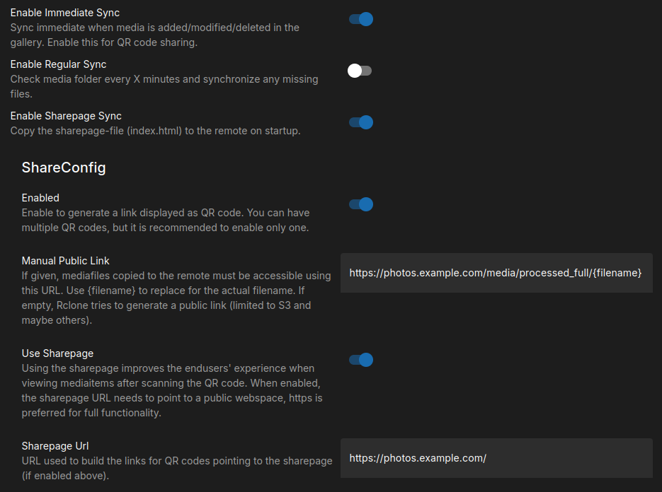
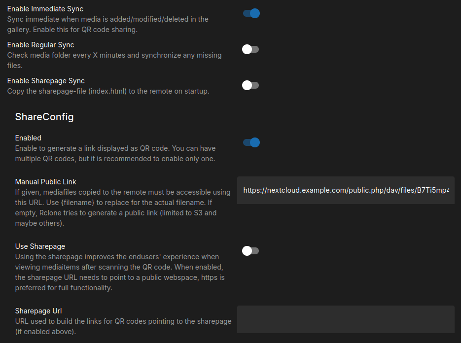

# Share using QR Codes

After [setting up the synchronization of media files](./synchronize.md), the photobooth-app's users can download their images, gifs and videos simply by scanning a QR code.

<figure markdown>
  { width="500" }
  <figcaption>Users scan the QR code to download the displayed image on their mobile.</figcaption>
</figure>

The QR code could point directly to the image URL or to a sharepage embedding the image.
When using the sharepage, a bold share button is displayed next to the image.
Using the sharepage might be more convenient for endusers because sharing to social media and messaging apps is very easy.

  
  

<figcaption style="text-align: center;">The sharepage with a media file being displayed on the endusers phone (left) and the phones native share menu (right).</figcaption>

The sharepage is just one single [HTML page](https://github.com/photobooth-app/photobooth-app/tree/main/src/web/sharepage) and basically a loader for the media files.
To use it, the HTML page needs to be hosted on a webserver that is accessible from the internet.
Due to security reasons, the HTML page needs to be located on the same host as the media files.

## Options generate QR codes

For QR code sharing, a prerequisite is to make the media files available online. The files need to be accessible from the public internet so they can be downloaded on the smartphones of the endusers.

| Option                  | A) Synchronizer (recommended)                                                                                                                      | B) Your custom solution                                                                                      |
| ----------------------- | -------------------------------------------------------------------------------------------------------------------------------------------------- | ------------------------------------------------------------------------------------------------------------ |
| Description             | Generate QR codes pointing the media files hosted online.                                                                                          | Share via local WiFi-Hotspot                                                                                 |
| Prerequisites           | Online hosting service, [synchronization is setup using rclone, see separate setup](./synchronize.md)                                              | WiFi Hotspot                                                                                                 |
| Connectivity            | Online, Internet required                                                                                                                          | Offline, no Internet required                                                                                |
| Complexity for endusers | Easy                                                                                                                                               | Complex, users need to access the local WiFi                                                                 |
| Complexity to setup     | Medium, need to setup Rclone                                                                                                                       | Advanced                                                                                                     |
| Pros                    | ➕ Automatic immediate and time-interval synchronization ➕ Quite easy setup ➕ Convenient for users ➕ Could be used as immediate backup | ➕ No need to synchronize ➕ No issues if internet service is bad ➕ Less likely to conflict with GDPR |
| Cons                    | ➖ Internet service might fail any time ➖ Images shared via (private) internet service might conflict with GDPR                                | ➖ Inconvenient for user: Smartphones need to log in local WiFi ➖ Custom setup                           |

## Generate QR codes for Rclone remotes (Option A)

!!! info

    Description is valid for v9 and later. For older versions, please see the former, deprecated [synchronization tool description](./synchronizelegacy.md).

To make the media files downloadable using a QR code, the [files need to be synchronized prior download](./synchronize.md). Please ensure the synchronization is setup properly beforehand and turn on `enable immediate sync` to upload the media files right after the capture.

Depending on the storage type you use, the sharepage is a good addition or not. If the storage type has it's own frontend, like NextCloud, Google Photos and similar you probably do not want to setup the sharepage but point the QR code directly to the image URL.
If there is no frontend, like for FTP or S3 buckets, the sharepage is a good addition.

Please follow one of the next chapters for a reference with/without sharepage.

### Setup using the Sharepage (Example using FTP)

Please configure the rclone remote as follows:

- `enable immediate sync` true, to upload the media files right after the capture.
- `enable sharepage sync` true, so the sharepage is created and updated as needed on every app startup on the remote.
- In the ShareConfig section:
    - `enabled` true, so this remote is generating a QR code when requested.
    - `manual public link` set to the URL which points to the mediafile on the server. `{filename}` is replaced by the filename when generating the link.
      Example: If the FTP server synchronized to is `ftp.example.com` and a webserver serves the same folder uploaded on `https://photos.example.com`, you set the public link to `https://photos.example.com/media/processed_full/{filename}`. The media folder is created during synchronization automatically.
    - `use sharepage` true, so the QR code points to the sharepage configured in next step instead displaying only the image.
    - `sharepage url` set to the URL which points to the sharepage on the server. The sharepage needs to be on the same host, which is automatically true if the sharepage is synchronized automatically (`enable sharepage sync`). Usually the URL is the base of the host, so in this example `https://photos.example.com`.

### Setup without Sharepage (Example using NextCloud)

Please configure the rclone remote as follows:

- `enable immediate sync` true, to upload the media files right after the capture.
- `enable sharepage sync` false, since there is no way to serve the HTML file using NextCloud.
- In the ShareConfig section:
    - `enabled` true, so this remote is generating a QR code when requested.
    - `manual public link`: Rclone does not support automatic link creation for NextCloud (WebDAV). You need to create a share link in the NextCloud filemanager and concatenate the link manually for further use.
      Example: The NextCloud share-link is `https://nextcloud.example.com/index.php/s/B7Ti5mp4JtYpktP` and allows for public display of the folders content. This translates to a public link as follows: `https://nextcloud.example.com/public.php/dav/files/B7Ti5mp4JtYpktP/media/processed_full/{filename}`. Please note to replace the share-id in the example link!. `{filename}` is replaced by the filename when generating the link. The media folder is created during synchronization automatically.
    - `use sharepage` false, so the QR code points directly to the manual public link.
    - `sharepage url` is not used.

## Generate QR codes for your custom solution (Option B)

If the synchronizer plugin is not what you want, you could deploy your own solution.
For example create a local WiFi that allows user access to the photobooth.
Users log in that WiFi and can download directly from the photobooth without internet services.
Setup the URL for the QR code to point to the image you would like to let the user download.
There are several versions of the images available, see the [list of mediaitem's directories](../../reference/foldersandurls.md#mediaitems).

Below an example URL to use in the QR code. {identifier} gets replaced by the actual filename. Replace the IP and port by the actual data.

Custom solutions are out of scope of the documentation. You need to figure out a way to make the media files accessible.
Then configure the QR code custom URL to point to the corresponding URL.

Setup:

- Admin Dashboard → Configuration → QrShare → Enable
- On the same page → Textfield `Share Custom Qr Url` set it to your custom URL serving the media e.g.: `http://localhost:8000/media/full/{identifier}`
