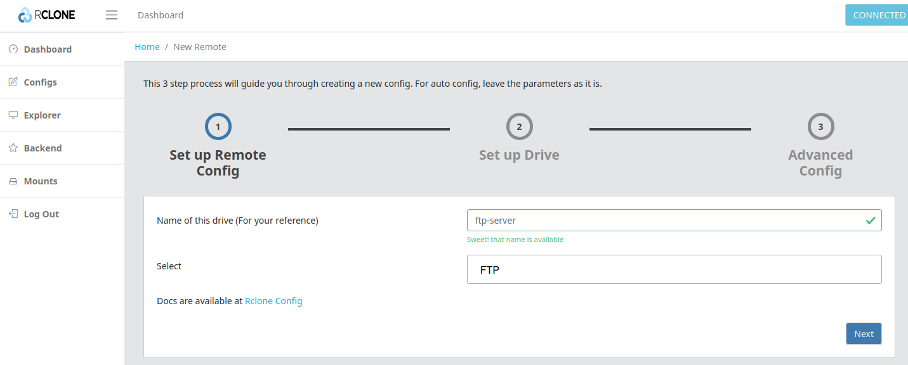
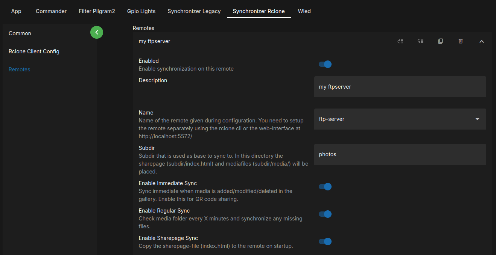

# Synchronize Mediaitems

## Setup the Synchronizer (since v9)

Since v9 Rclone was added as unified tool to synchronize to several storage types.

| Storage Type                                                      | Description                                                                                                                                                                                                                                           |
| ----------------------------------------------------------------- | ----------------------------------------------------------------------------------------------------------------------------------------------------------------------------------------------------------------------------------------------------- |
| FTP                                                               | Great for immediate online backups. Also very simple to setup qr code sharing if the uploaded files are made automatically accessible via HTTPS by the service provider.                                                                              |
| NextCloud                                                         | Could be a good option if the media shall be made accessible in a gallery provided by Nextcloud. The photobooth-apps included sharepage cannot be setup automatically in this scenario.                                                               |
| S3                                                                | S3 object stores are available from many cloud infrastructure providers. It works well but needs a CDN in front of the bucket for HTTPS and full sharepage functionality. Depending on the provider the costs can be as low as a few cents per month. |
| local filesystem                                                  | This type is used for data duplication only, not intended to be used to share QR codes.                                                                                                                                                               |
| [other, see rclone overview](https://rclone.org/overview/) custom |                                                                                                                                                                                                                                                       |

The general procedure to setup synchronization is as follows:

- In the Admin Center go to Configuration → Synchronizer → Set Enabled to on, save config and apply.
- Rclone is started in the background during the app's runtime, you can access the Rclone web-UI on the same device browsing to (<http://localhost:5572>)
- Configure a remote in Rclone. There are many storage types supported, please see the Rclone+Service provider documentation how to setup.
- After having the remote configured, in the remotes tab, add a new remote and select the newly created remote name.
- Save the configuration.
- Take a picture and check the logs for issues during uploading.
- If there are no errors, double check at the service provider webpage, that all media files have been uploaded as expected.

## Reference Setups

!!! note

    Following description is to setup the file synchronization using Rclone. It is a prerequisite to allow for [QR code sharing to be setup separately](./qrshareservice.md).

All targes, Rclone supports, can be used. Some might work better than others, and not all setups are described here.
The most straight forward way to allow for QR code shares is probably FTP on a shared webspace that supports HTTPS (shared webhosting).

Exemplarily, a setup using a FTP-Server is described in the following sections. For all supported services see the [rclone overview](https://rclone.org/overview/).

### Rclone Remote Setup

!!! info "Assumptions for the FTP-Server setup example"

    - FTP-Server: `ftpserver.example.com`
    - FTP-Subdir: `/photos/`
    - HTTP-URL: `https://photos.example.com/`,
    - Verified: Files uploaded to the folder `photos` on the FTP-Server are available at `https://photos.example.com/`

#### Rclone Configuration

With the photobooth-app started, open a browser on the same device running the photobooth-app and browse to <http://localhost:5572>.
It should display the Rclone WebUI Dashboard. You can use it to administer all Rclone related aspects of the synchronization, thus as create/modify remotes and monitor Rclone's status.



The result is an entry in the rclone config similar as follows, given for your reference here:

```ini title="~/.config/rclone.rclone.conf"
[ftp-server]
type = ftp
host = ftpserver.example.com
pass = GP**************BqKY5
```

After the configuration is finished, please ensure in the Rclone WebUI → Explorer that the remote loads properly.

#### App Configuration

Next step is to tell the photobooth-app to use the remote configured. In the admin center go to the synchronization configuration and add a new remote to the list:



It's recommended to enable all synchronization types usually:

- `Enable Immediate Sync` to upload new/modified media files directly - a prerequisite for QR code sharing.
- `Enable Regular Sync` to check every 5 minutes (default) if any files need to be synchronized. If the internet connection is weak and an immediate upload failed, this could help to ensure a consistent state on the remote. Also, this option is useful for backup copies.
- `Enable Sharepage Sync` to copy the sharepage to the remote. If you want to use the sharepage, enable this, otherwise disable. Find [more details in the description to share using QR codes](./qrshareservice.md)

#### Generate QR Codes

Want to display QR codes in the gallery for a remote?
Check the [separate description how to generate QR codes](./qrshareservice.md)

### Local Filesystem

Synchronizing to the local filesystem could be used to copy data to external usb drives to backup the media files.

#### Rclone Setup (Local)

For a local target, there is no setup in rclone required.

#### Synchronizer Setup (Local)

TODO: Add implementation to separate local/remotes
