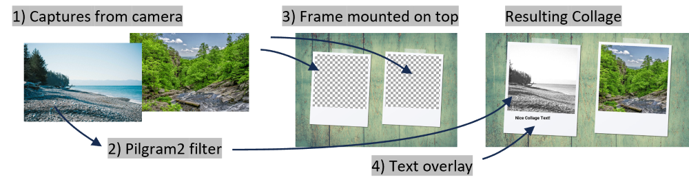

# Postprocess Images and Collages

The mediaitems (images, videos, gifs) are postprocessed in a configurable pipeline consisting of several stages.
The pipeline starts with the original mediaitem. Next is the stage to remove a greenscreen, add texts and a new background. The final processed item is stored to the gallery.

## Examples

### Single Images

TODO: add example image

### Collages

Collages are merged from several images. These can be captured images from camera and being mixed with predefined images.
Each capture can be modified, eg. remove the greenscreen and add a new background before merging in the collage.
Following is an example how the collage is processed:

## Pipelines

Depending on the job type

- single picture or
- collage or
- printing

there are different postprocess pipelines available. They can be configured in the admin dashboard.
The pipeline consists of several stages, each can be enabled and configured separately.

## Basics

- Coordinate system: 0/0 is top/left.

### Picture-Pipeline

The single image pipeline runs following stages in given sequence:

1. remove chromakey (greenscreen removal), replace by transparency
2. apply pilgram2 filter (instagram like filters)
3. fill background with a solid color
4. add background image (useful only if no solid color was added)
5. add a frame with transparent areas. Captured images shine through transparent area. Use PNGs with transparency!
6. text overlay

### Collage-Pipeline

The collage pipeline runs following stages in given sequence:

  1. run single images stages (chromakey, pilgram2, background only)
  2. merge captured images and predefined images on one canvas
  3. fill background with a solid color
  4. add background image (useful only if no solid color was added)
  5. place image on top. Captured images shine through transparent area. Use PNGs with transparency!
  6. text overlay

### GIF/Video-Pipeline

Feature not yet implemented. You're invited to contribute. 👋

### Print-Pipeline

Feature not yet implemented. You're invited to contribute. 👋

## Stages

### Chromakeying

Remove a color from the captured image. Removed parts will be transparent.
TODO: add more description about how to choose the green value.

### Instagram-Like Color-Filter

Apply a default color filter. Choose from [pilgram2's available filters](https://github.com/photobooth-app/pilgram2).
There is also the option for the user to change the filter in the gallery. See UI configuration in admin dashboard.

### Background Fill Solid Color

When using the chromakeying / background removal stages, the removed background is left empty and transparent. With this stage, the transparent area is filled with a solid color.

### Background Image

When using the chromakeying / background removal stages, the removed background is left empty and transparent. With this stage, the transparent area is filled with an image.

### Frame Image

Single images captured can be overlaid by a frame. For this stage you need a PNG with transparent area. The captured image will be inserted in the transparent area. The width and height of the transparent area is automatically calculated and the algorithm tries to fit most of the captured area. If aspect ratio of captured image and transparent area are very different, some parts of the captured image can be cropped.

### Texts

Texts that are overlaid the finished image. Use it to easily individualize the images without having to create a new background images where a picture would get inserted to. Custom fonts are supported.
