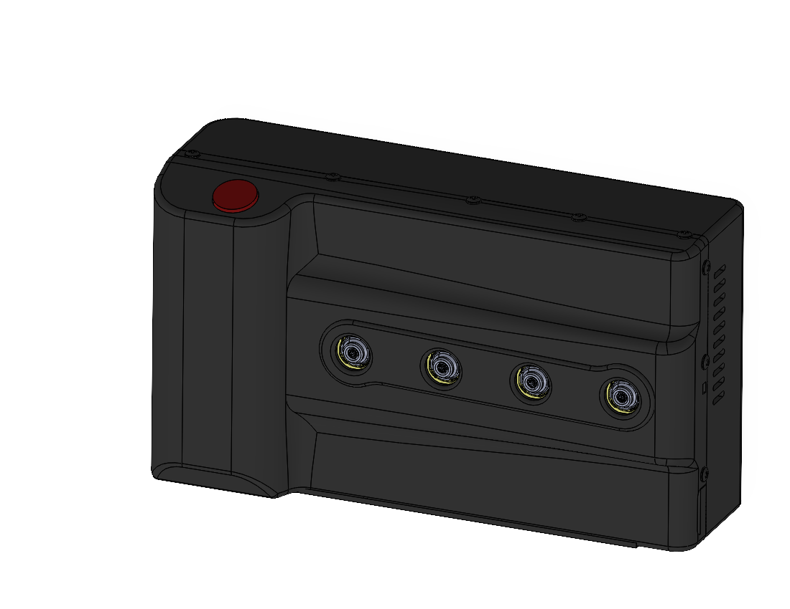
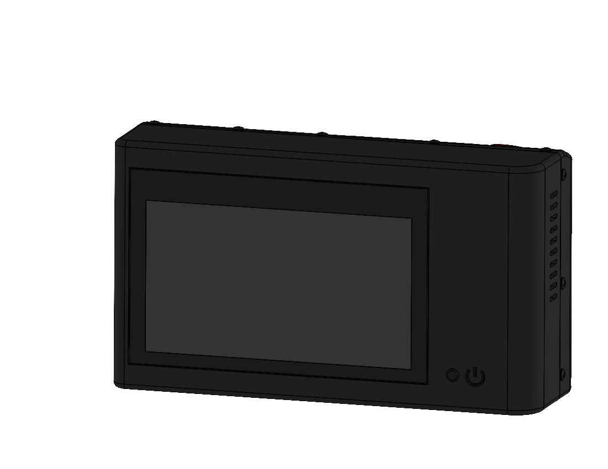
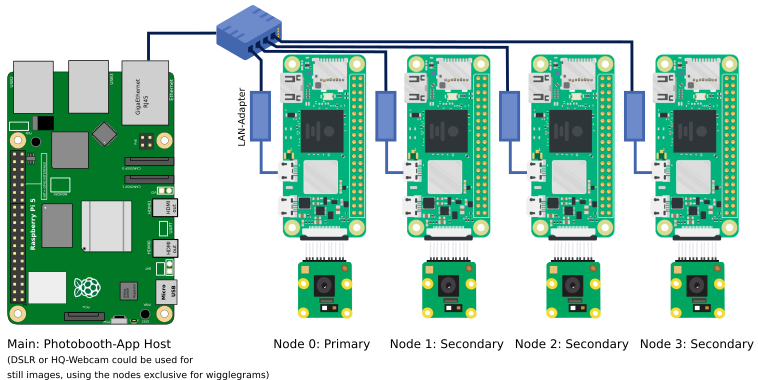

# Build the Hardware

!!! info
    This is all experimental! 🧪

<figure markdown>
  { width="400" }
  <figcaption>TODO</figcaption>
</figure>

<figure markdown>
  { width="400" }
  <figcaption>TODO</figcaption>
</figure>

## Prepare Components

To capture wigglegrams you need a camera array. There is a 3d printed reference design that would give you a starting point.
Find the latest design files in the [photobooth-app/photobooth-3d repository](https://github.com/photobooth-app/photobooth-3d).

### Bill of Materials (BOM)

- List materials used.
- TODO

## Wiring Diagram

{ width="400" }

## Assembly

TODO
