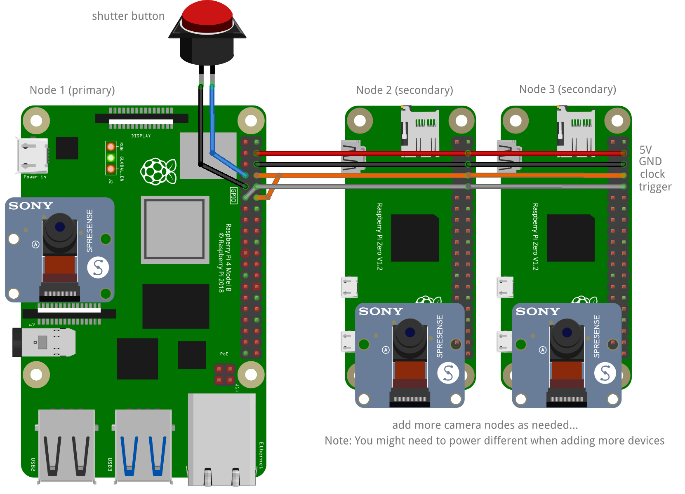

# Build the Hardware

<figure markdown>
  { width="400" }
  <figcaption>Interior of the photobooth. 4 cameras are used in the reference design, but the number of cameras is not limited.</figcaption>
</figure>

<figure markdown>
  { width="400" }
  <figcaption>Camera array with 4 Raspberry Pi Camera module 3 hooked each to a Pi Zero 2W. The Pi Zeros are connected to the ethernet using an USB-Ethernet adapter.</figcaption>
</figure>

## Prepare Components

To capture wigglegrams you need a camera array. There is a 3d printed reference design that would give you a starting point.
Find the latest design files in the [photobooth-app/photobooth-3d repository](https://github.com/photobooth-app/photobooth-3d).

### Bill of Materials (BOM)

#### Per Node

- Raspberry Pi Zero 2W
- Raspberry Pi Camera Module 3 (other cameras should work also, but use original modules)
- CSI cable ~15cm
- Micro-USB Ethernet Adapter
- Ethernet cable

#### Per System

- Network Switch with at least 5 ports
- Ethernet cable
- Rasbperry Pi 4/5 running the photobooth-app
- 3d printed parts

You might need additional screws or other minor parts not mentioned here. We do not describe how to power the hardware as it is very specific to the custom setup usually.

## Wiring Diagram

{ width="400" }

## Assembly

TODO

## Network Setup

The nodes and the system with the photobooth-app need to be able to talk reliably with each other. WiFi works also, but it is not recommended in a final setup.

Please note, the nodes should be able to access the internet later so they can receive updated software. It is recommended to use a router in the photobooth during events. If the router also provides internet access you can use it to update the software when needed.
If not, for update purposes, the router in the photobooth could be disconnected and instead the photobooth-network is connected to the home router with internet.

### Setup with DHCP (using router as DHCP server, recommended)

TODO

### Setup with DHCP (using the photobooth-app host as DHCP server)

TODO

### Setup static IPs without router (not recommended)

TODO
