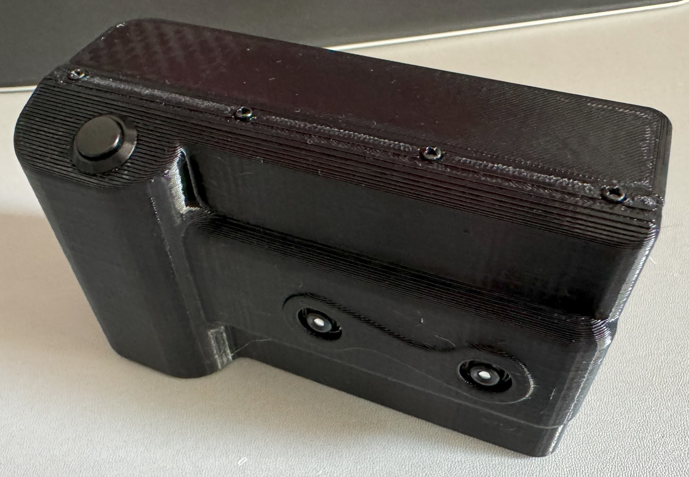
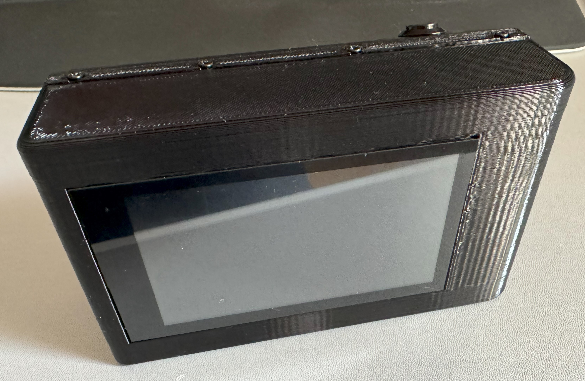

# Wigglegram Camera

There is more to your photobooth! Starting from v5 the photobooth-app integrates with our new multicamera backend.
It allows to capture photos from several cameras at the same time to create 3d effect GIFs.

In this subsection, the build and setup of the wigglecam is described.

!!! info
    This is all experimental! 🧪

Excited? This is how the the camera looks like:

<figure markdown>
  { width="400" }
  <figcaption>Wigglegram taken with 2 cameras and interpolated using the RIFE model</figcaption>
</figure>

<figure markdown>
  { width="400" }
  <figcaption>First version of the camera, front.</figcaption>
</figure>

<figure markdown>
  { width="400" }
  <figcaption>First version of the camera, back.</figcaption>
</figure>

## 😍 What it is

🧪 Python software to capture wigglegrams using multiple cameras  
🧪 Software synchronized Raspberry Pi camera modules, using picamera2  
🧪 3d printed camera housing  
🧪 Creating smooth videos from just two images using frame interpolation AI algorithms  

## Current Version 

The wigglecam is not yet released. Use the links below to find out more before tackling to build your camera.

## Links

- [Github source](https://github.com/photobooth-app/wigglecam/)
- [3d printable case](https://github.com/photobooth-app/wigglecam-3d)
- [Issues](https://github.com/photobooth-app/wigglecam/issues)
- [Discussions](https://github.com/photobooth-app/photobooth-app/discussions)
