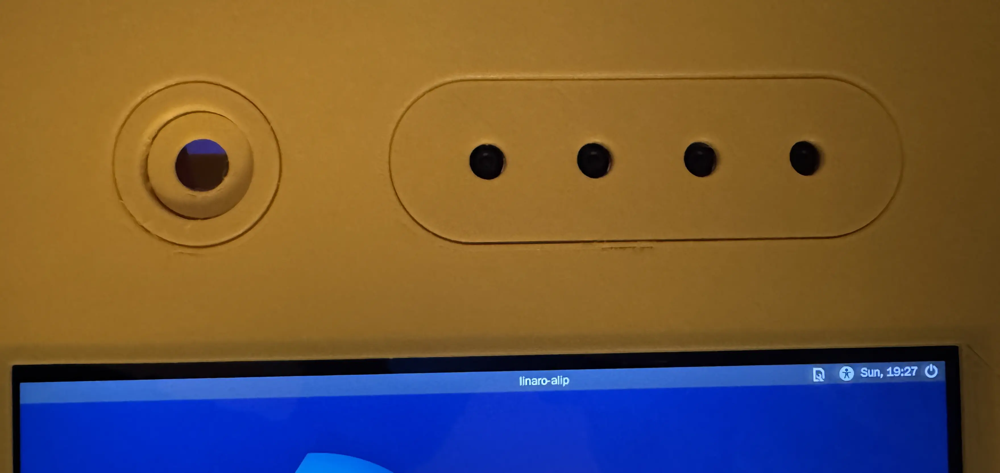

# Wigglegram Camera

Wiggle, wiggle, wiggle! 😜There’s so much more to your photobooth-app than you can imagine!

Starting with version 8.5, the photobooth-app introduces an incredible new feature: wigglegrams created through seamless integration with the [wigglecam nodes](https://github.com/photobooth-app/wigglecam). Several nodes form a camera array that captures a scene from slightly different perspectives.

This technique lets you shoot stunning photos using multiple cameras arranged in perfect sync — all firing at the same time.

The result? An awesome short animated image with a breathtaking 3D effect. Just picture it... see yourself!

<figure markdown>
  { width="400" }
  <figcaption>Wigglegram taken with 2 cameras and interpolated using AI</figcaption>
</figure>

<figure markdown>
  { width="400" }
  <figcaption>Camera array with 4 Raspberry Pi Camera module 3 to capture wigglegrams. Additionally, any other camera (DSLR, Webcam, ...) can be used for high quality photos.</figcaption>
</figure>

Browse through the other documents to get the full idea, how to build and setup the camera array to create wigglegrams.

## 😍 Features

- 💨 __Reference Setup to start__

    Use the reference setup to get started quickly. You can always add more cameras later.

    [:octicons-arrow-right-24: Build the hardware](./build.md)

- 🤖 __Orchestrate using Ansible__

    Although each camera in the array uses a dedicated Pi Zero, Ansible simplifies maintenance by keeping all nodes up to date.

    [:octicons-arrow-right-24: Installation](./installation.md)

- 📸 __Raspberry Pi Camera supported__

    For now, the nodes support Raspberry Pi cameras. It's designed to be extendable, so a DSLR could be added in the future.

- 🎇 __Virtual Mode__

    You don't need the full hardware available to tinker around and set up. As with the photobooth-app, there is an image generator to test the setup.

- 🪝 __Hook up with your photobooth-app__

    After installing the WiggleCam software on each camera node, users can create awesome Wigglegrams using the photobooth-app.

## Find more information

- [photobooth-app/wigglecam GitHub Repository](https://github.com/photobooth-app/wigglecam/)
- [3d printable case](https://github.com/photobooth-app/wigglecam-3d)
- [Issues](https://github.com/photobooth-app/wigglecam/issues)
- [Discussions](https://github.com/photobooth-app/photobooth-app/discussions)
