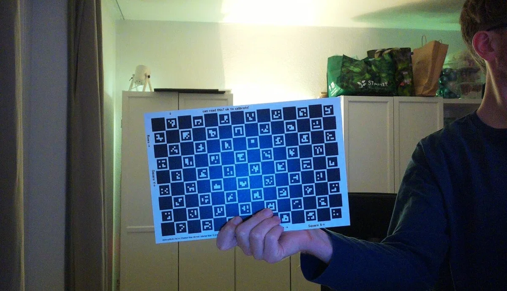
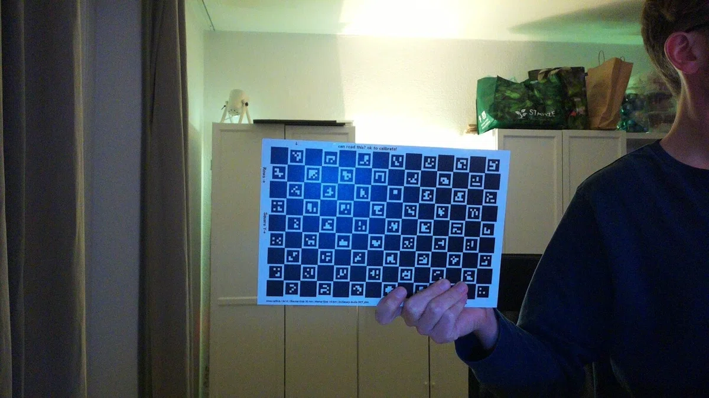

# Wigglegrams made with the App

<figure markdown>
  { width="400" }
  <figcaption>Me holding the ChAruCo board with the automatic calibration applied resulting in smooth results.</figcaption>
</figure>

<figure markdown>
  { width="400" }
  <figcaption>Before calibration, the raw camera images combined to a very rough animation.</figcaption>
</figure>

<figure markdown>
  { width="400" }
  <figcaption>Early prototype wigglegram taken with 2 cameras and interpolated using RIFE AI model in manual postprocessing.</figcaption>
</figure>
